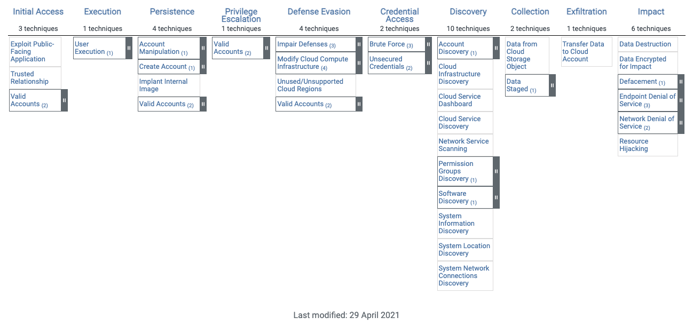

# GCP MITRE ATT&CK External Repository

This repository consists of two primary directories, `scripts` and `gcp-audit-logs`.   The content is based on the fwd:cloudsec conference talk, [OH CR&P! I think we've been breached](https://fwdcloudsec.org/speakers.html#oh-crp) presented on September 13, 2021.

For reference, the MITRE ATT&CK Enterprise Cloud IAAS matrix is listed here below:

* [Enterprise Cloud IAAS Matrix](https://attack.mitre.org/matrices/enterprise/cloud/iaas/)



## Section: Scripts

The directory `scripts` contains sequential details on the TTPs discussed during the conversation.

## Section: GCP Audit Logs

The directory `gcp-audit-logs` contains details on examples of the logs generated during the TTPs and scenarios discussed.

## Disclaimer

```Copyright 2021 Google LLC. This software is provided as-is, without warranty or representation for any use or purpose. Your use of it is subject to your agreement with Google.```
